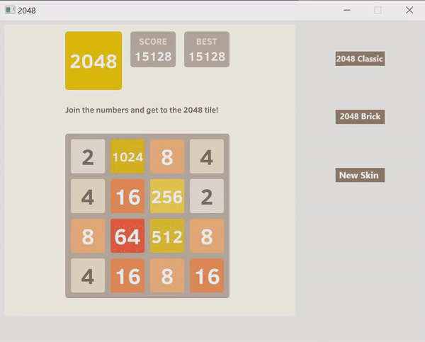

# OopFinalProject
C++ game 2048

Start Project Date: July 10, 2020

End Project Date: 
## Team
- **`19127463` Nguyễn Hoàng Long**
  - **Facebook:** [Hoang Long Nguyen](https://www.facebook.com/profile.php?id=100014108702108)
  - **Email:** 19127463@student.hcmus.edu.vn

- **`19127012` Vũ Nguyễn Thái Bình**
  - **Facebook:** [Vũ Bình](https://www.facebook.com/vubinh.hcmus)
  - **Email:** binh161905@gmail.com

- **`19127564` Nguyễn Hữu Thông**
  - **Facebook:** [Thông Nguyễn](https://www.facebook.com/t.ahhahaha)
  - **Email:** 19127564@student.hcmus.edu.vn
  
- **`19127507` Nguyễn Quang Phú**
  - **Facebook:** [Nguyễn Quang Phú](https://www.facebook.com/nqp2805)
  - **Email:** 19127507@student.hcmus.edu.vn
## Project Planner
- [x] **Setup and using SFML library**
- [x] **More option**
- [x] **Animation**
- [x] **Resourcepacks**
- [x] **2048 Classic**
  - [x] Gameplay
  - [x] Control
  - [x] Title
  - [x] Save/load
  - [x] Texture
- [x] **2048 Brick**
  - [x] Gameplay
  - [x] Control
  - [x] Title
  - [x] Save/load
  - [x] Textures
## How to play ?
Use your arrow keys to move the tiles. When two tiles with the same number touch, they merge into one!

There are 2 modes: classical mode and brick mode.

There also are 2 skins for you to choose: classical skin and minecraft skin.

**Classical Mode**

**Brick Mode**

**Minecraft Skin**

